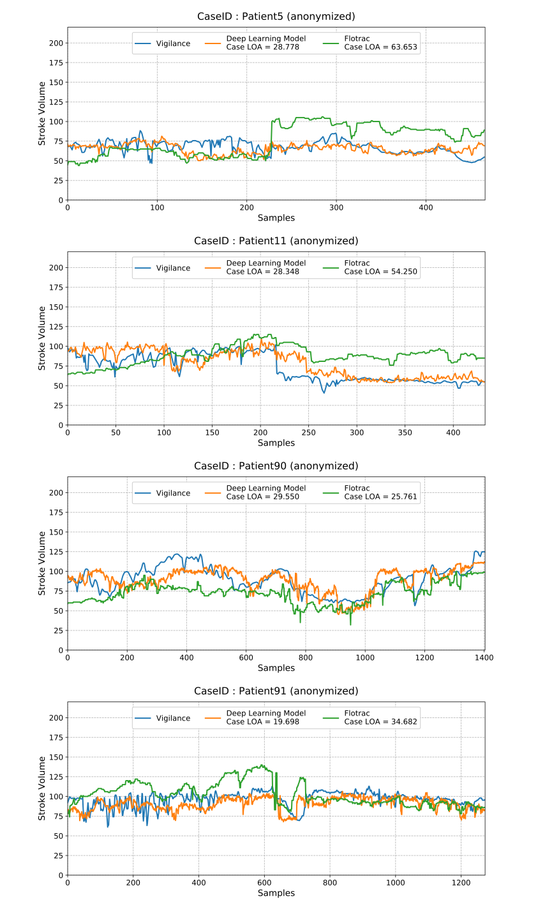

APCONet: <br/> AI model for arterial pressure waveform derived cardiac output
----------------------------------------------------
This repository is the official python implementation of APCONet-v1.

> Author: [Hyun-Lim Yang](https://sites.google.com/view/hyunlim-yang) 
(*[VitalLab](https://vitallab.ai/)*, SNUH, South Korea) <br/>

> Credits: <br/>
> * Hyung-Chul Lee (*[VitalLab](https://vitaldb.net/)*, SNUH, South Korea)
> * Chul-Woo Jung (*[VitalLab](https://vitaldb.net/)*, SNUH, South Korea)
> * [Min-Soo Kim](http://infolab.kaist.ac.kr/members/Min-Soo%20Kim/) 
(*[InfoLab](http://infolab.kaist.ac.kr/)*, KAIST, South Korea)

---
> [!NOTE]
> Our codes and models are now fully available via the pyvital package, an open-source Python package. <br/>
> You can find the .pth file for pretrained weight in the following link (as sv_dlapco): <br/>
> [https://github.com/vitaldb/pyvital/tree/master/pyvital/filters](https://github.com/vitaldb/pyvital/blob/master/pyvital/filters/sv_dlapco.py)
> 
> And, you can see the latest PyPI via pip. <br/>
> [https://pypi.org/project/pyvital/](https://pypi.org/project/pyvital/)
>
> For detailed instructions on how to use filters, please refer to the examples below. <br/>
> [https://github.com/vitaldb/examples/blob/master/pyvital.ipynb](https://github.com/vitaldb/examples/blob/master/pyvital.ipynb)
> 
> Just use pip to install pyvital and enjoy APCONet!


---

APCONet is an end-to-end beat-to-beat deep learning model for Stroke Volume monitoring.<br/>
It predicts Stroke Volume from 100Hz 20-second of arterial blood pressure and demographic information (age, sex, height weights).<br/>

>:heavy_exclamation_mark: **For Vital Recorder User** <br>
> Our program is developed with great thanks to [VitalDB](https://vitaldb.net/) in Seoul National University Hospital, 
> and we provide real-time AWS cloud-base prediction in line with Vital Recorder web monitoring system!<br/>
> Please feel free to try out our works in your clinical practice :) <br/>
> If you are new to Vital Recorder, please refer to the [demo](https://vitaldb.net/web-monitoring/) 
> or figure out what you can do with Vital Recorder from the [Vital Recorder Paper](https://www.nature.com/articles/s41598-018-20062-4). 
> <br><br>
> :bangbang: **Warning**<br>
> Commercial use of APCONet system without our permission are **STRICTLY NOT ALLOWED**. 
> APCONet for web monitoring system might be updated or replaced for improvement without any announcements.
> We do not guarantees the APCONet's consistency.
> If you would like to do research with APCONet, please contact us for collaborative works.

## Dataset
We share a de-identified dataset of pre-processed arterial blood pressure waveform and demographic information, 
and its corresponding pulmonary artery catheter derived stroke volume which were used for tuning APCONet.<br/>
You can download the data [here](https://drive.google.com/drive/folders/10PXC6Izwosqz5gY_4XctWlHqS6hVTiz-?usp=sharing).<br/>
Other full data which were used for pre-training is available upon request at [VitalDB databank](https://vitaldb.net/data-bank/).<br/>

## Model Training
To train the model, you can run the below script. <br/>
Dataset must be named and shaped as follows: <br/>

Variable Name     | Data Type   | Shape of data | Description
------------------|-------------|---------------|------------
`np_w_$VERSION$`  | Numpy array | (batch, 2000) | abp wave data with 20 second segment
`np_sv_$VERSION$` | Numpy array | (batch, )     | target stroke volume data
`np_a_$VERSION$`  | Numpy array | (batch, 4)    | demographic data with order of age, sex, weight, height
`np_c_$VERSION$`  | Numpy array | (batch, )     | chart names of each data point (it is used to split validation set)

`$VERSION$` indicates the version of dataset, which for convenience of dataset management <br/>
Default value of `$VERSION$` is `200101` of `yymmdd` format. <br/>

```
python3 apconet.py --mode train
```


## Model Inference
To evaluate the model, you can run the below script. <br/>
You can download the pretrained APCONet from [here (code)](https://github.com/vitaldb/pyvital/blob/master/pyvital/filters/sv_dlapco.py), and [here (weight)](https://github.com/vitaldb/pyvital/blob/master/pyvital/filters/model_dlapco_v1.pth). <br/>
Dataset must be numpy array of shape (batch, 2000) and shape of (batch, 4) for wave and demographic information respectively. <br/>
Note that if you do not specify the directory of your custom dataset, then the model will automatically used `sample_wave.np` and `sample_ashw.np`.<br/>

```
python3 apconet.py --mode test
```

## Sample Results



## Citation
Yang, H. L., Jung, C. W., Yang, S. M., Kim, M. S., Shim, S., Lee, K. H., & Lee, H. C. (2021). Development and Validation of an Arterial Pressure-Based Cardiac Output Algorithm Using a Convolutional Neural Network: Retrospective Study Based on Prospective Registry Data. JMIR Medical Informatics, 9(8), e24762.
